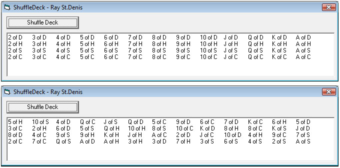



## How to shuffle a deck of cards efficiently

### Description

This example is to show how to shuffle a deck of cards using an extremely fast algorithm that does not have to check if a card has already been chosen. What this means is that the code is very fast making it very scalable as well. Although the example uses a deck of cards, it could just as easily be used to shuffle any series of objects with thousands of items.
 
### More Info
 
Unshuffled deck of cards

Shuffled deck of cards

             |
---                |---
**Submitted On**   |2010-03-17 10:07:20
**By**             |[Ray St\.Denis](https://github.com/Planet-Source-Code/PSCIndex/blob/master/ByAuthor/ray-st-denis.md)
**Level**          |Intermediate
**User Rating**    |5.0 (10 globes from 2 users)
**Compatibility**  |VB 6\.0
**Category**       |[Miscellaneous](https://github.com/Planet-Source-Code/PSCIndex/blob/master/ByCategory/miscellaneous__1-1.md)
**World**          |[Visual Basic](https://github.com/Planet-Source-Code/PSCIndex/blob/master/ByWorld/visual-basic.md)
**Archive File**   |[Ray2177233172010\.zip](https://github.com/Planet-Source-Code/ray-st-denis-how-to-shuffle-a-deck-of-cards-efficiently__1-73004/archive/master.zip)

